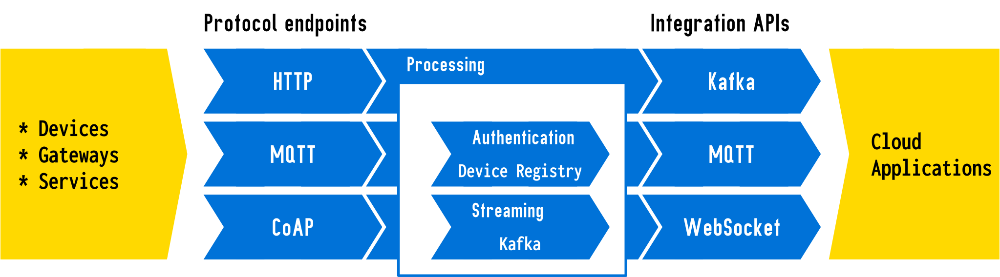

# Drogue IoT Cloud

> Cloud Native IoT.

Drogue IoT Cloud is an IoT/Edge connectivity layer that allows IoT devices to communicate with a cloud platform over
various protocols. It acts both as data ingestion plane, and as control plane. In short, Drogue IoT Cloud takes
care of the data on the cloud side.

It offers:
* IoT friendly protocol endpoints and APIs
* Protocol normalization based on Cloud Events
* Management of device credentials and properties
* APIs, a CLI, and a graphical console to manage devices and data flows

It is built on top of:
* *Kubernetes* – For running workloads
* *Cloud Events* - For normalizing transport protocols
* *Apache Kafka* – For persisting events
* *Keycloak* - For single-sign-on

You can learn more about the [architecture](https://book.drogue.io/drogue-cloud/dev/architecture/index.html) in
our [documentation](https://book.drogue.io/).

## Protocol Support

<table>
<tr><th>Device endpoints</th><th>Integration APIs</th></tr>
<tr><td>

* HTTP
  * Generic HTTP
  * The Things Network v2/v3
* MQTT v3.1.1/v5
* CoAP

</td><td>

* Kafka
* WebSocket
* MQTT v3.1.1/v5

</td></tr></table>

## Getting started

You can easily play with Drogue Cloud, using our public sandbox: [https://sandbox.drogue.cloud](https://sandbox.drogue.cloud)

### For users

Download a release from the [releases page](https://github.com/drogue-iot/drogue-cloud/releases), and follow our
[quick start instructions](https://github.com/drogue-iot/drogue-cloud/blob/main/installer/README.md).

Or take a look at the [deployment instructions](https://book.drogue.io/drogue-cloud/dev/deployment/), and read about
the deployment in more detail.

### For developers

If you know what you are doing, and have a cluster running, and a clone of the repository, you can deploy the
"latest" version of Drogue Cloud by executing the following command:

~~~shell
make deploy CLUSTER=<type>
~~~

For Minikube this would be:

~~~shell
make deploy CLUSTER=minikube
~~~

## Useful Links

* [Blog](https://blog.drogue.io/)
* [Documentation](https://book.drogue.io/drogue-cloud/dev/index.html)
* [Workshops](https://book.drogue.io/drogue-workshops/index.html)
* [Public sandbox](https://sandbox.drogue.cloud)

## Contributing

See the document [CONTRIBUTING.md](CONTRIBUTING.md).

## Community

* [Drogue IoT Matrix Chat Room](https://matrix.to/#/#drogue-iot:matrix.org)
* We have bi-weekly calls at 9:00 AM (GMT). [Check the calendar](https://calendar.google.com/calendar/u/0/embed?src=ofuctjec399jr6kara7n0uidqg@group.calendar.google.com&pli=1) to see which week we are having the next call, and feel free to join!
* [Drogue IoT Forum](https://discourse.drogue.io/)
* [Drogue IoT YouTube channel](https://www.youtube.com/channel/UC7GZUy2hKidvY6V_3QZfCcA)
* [Follow us on Twitter!](https://twitter.com/DrogueIoT)
