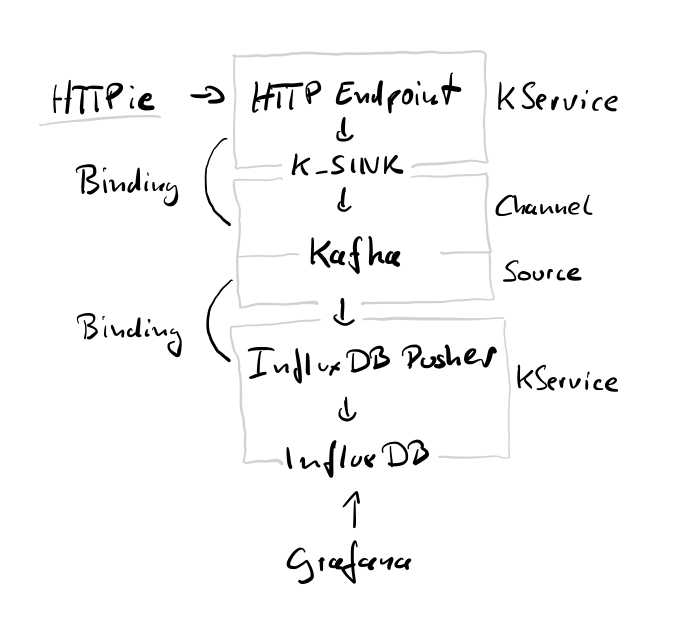

:icons: font

ifdef::env-github[]
:tip-caption: :bulb:
:note-caption: :information_source:
:important-caption: :heavy_exclamation_mark:
:caution-caption: :fire:
:warning-caption: :warning:
endif::[]

:toc:
:toc-placement!:

= Deploying

This guide should take your through the process of deploying the example.

NOTE: All commands are relative to the root of the repository.

'''

toc::[]

== Pre-requisites

The following pre-requisites are required to run this. As there are many ways to obtain them, I will stick to my
own environment, and try to point out possible differences.

Also, there may be newer versions of the components I used, maybe you can upgrade, maybe not.

=== Command line tools

The usual command line tools. I would like to call out the following:

* `kn` - The Knative command line tool. Not required, but might come in handy.
* `oc` / `kubectl` - In our case, there isn't a big difference. I try to go for `kubectl`, but should
you encounter `oc`, then just swap it. And/or raise a PR 😉
* `http` - aka https://httpie.org/[HTTPie]
* `mqtt` - aka https://github.com/hivemq/mqtt-cli[MQTT CLI]

=== Kubernetes

You will need an installation of Kubernetes. I am using OpenShift 4.5, but you should be able to take any other
Kubernetes 1.17+.

The biggest differences from OpenShift to Kubernetes may be:

* The lack of the `Route` CRD. Which exposes services easily, without requiring any load balancer or other tunnel
  workarounds.
* The lack of an internal image registry. Which you can ignore if you build and host your images manually, or use our provided image.

Although I am using a dedicated cluster, using
https://developers.redhat.com/products/codeready-containers/overview[CRC]footnote:[CodeReady Containers, OpenShift in a local VM] 
or https://kubernetes.io/docs/tasks/tools/install-minikube/[Minikube] 
should be possible as well. Just ensure that you bring enough CPU and RAM.

=== Knative 0.13.x

On the cluster, you will need https://knative.dev/[Knative], including the following features:

* Serving
* Eventing
* Kafka event support

The easiest way is to get the https://operatorhub.io/operator/knative-operator[Knative operator],
through OperatorHub. Then install https://knative.dev/docs/install/knative-with-operators/#installing-the-knative-serving-component[serving and eventing].

I needed to add the Kafka eventing after that, I used the https://github.com/openshift-knative/knative-kafka-operator[knative kafka operator]. If you are using Openshift, you can follow https://openshift-knative.github.io/docs/docs/proc_apache-kafka.html[this guide].
Install the operator following these instructions, but don't create any CRfootnote:[custom resource] yet.

=== Strimzi

For Kafka, this deployment requires https://strimzi.io/[Strimzi]. I deployed "Strimzi" from OperatorHub.

== Performing the deployment

Once you have all pre-requisites installed, you can start deploying.

=== Create a new namespace

----
oc new-project drogue-iot
oc label namespace drogue-iot bindings.knative.dev/include=true
----

Or:

----
kubectl create namespace drogue-iot
kubectl label namespace drogue-iot bindings.knative.dev/include=true
kubectl config set-context --current --namespace=drogue-iot
----

NOTE: Unless noted otherwise, the guide will expect that your context defaults to the `drogue-iot` namespace.

WARNING: Currently, some parts of the deployment actually expect the name `drogue-iot`. If you change it, you will
break things.

=== Tekton Pipelines 0.11 (optional)

The images can be built in the cluster using Tekton, see link:build.adoc[].

If you want to build drogue manually see the next section. You can also skip it and use our pre-built images.

=== Local build

If you don't want to use build pipelines, you can run the following command:

----
make CONTAINER_REGISTRY=quay.io/my-user
----

This will push the following images, be sure to grant access to them (aka make them public):

* `http-endpoint`
* `mqtt-endpoint`
* `influxdb-pusher`

=== Deploy Kafka

This deploys a Kafka cluster and creates the Kafka channel capability.

[NOTE]
====
The following command operates on the namespace `knative-eventing`. The namespace is specified in the YAML file.
So be careful here when use `kubectl` with `-n`.
====

----
kubectl apply -f deploy/02-deploy/01-kafka
----

=== Deploy InfluxDB

Execute the following:

----
kubectl apply -f deploy/02-deploy/02-influxdb
----

=== Deploy Grafana

Execute the following:

----
kubectl apply -f deploy/02-deploy/03-dashboard
----

Credentials: `admin` / `admin123456`

=== Deploy Knative services

Depending on your environment, you need to fix the source of your images. Check the files,
and adapt the `image` field:

* `deploy/02-deploy/04-knative/110-Service-influxdb-pusher.yaml`
* `deploy/02-deploy/05-endpoints/http/020-Service-http-endpoint.yaml`
* `deploy/02-deploy/05-endpoints/mqtt/010-Deployment-mqtt-endpoint.yaml`

You must also provide a TLS certificate for the MQTT endpoint. You can create a secret like this:

----
kubectl create secret tls mqtt-endpoint-tls --key server.key --cert fullchain.pem
----

Also see: link:02-deploy/05-endpoints/mqtt/010-Secret-mqtt.yaml[02-deploy/05-endpoints/mqtt/010-Secret-mqtt.yaml]

NOTE: The default values point to our built images, hosted on https://quay.io/drogueiot[the drogueiot quay organisation].

Then execute the following:

----
kubectl apply -f deploy/02-deploy/04-knative
kubectl apply -f deploy/02-deploy/05-endpoints/http
kubectl apply -f deploy/02-deploy/05-endpoints/mqtt
----

== Testing

=== Endpoints

First you need to figure out the endpoints for the Grafana instance and the HTTP adapter.

If you are running on OpenShift, and have properly configured the ingress operator, then this should be easy.

The following command should give you the endpoint of the Grafana instance and the MQTT endpoint:
----
oc get routes
----

While the next command gives you the URL of the HTTP endpoint:

----
kn route describe http-endpoint
----

NOTE: It may be that the endpoint of the Knative service is listed as `http:`, while in fact it is `https:`.

NOTE: If you are not running on OpenShift, you may need some extra configuration for exposing services. Please check
with the documentation of your Kubernetes variant.

=== Dashboard

Login in to the Grafana instance and open the dashboard "Knative test". Double check that it is set to
automatically reload.

=== Publish data using HTTP

==== Execute

From the command line run (and be sure to replace the URL with your own):

----
http POST https://http-endpoint-drogue-iot.apps.my.cluster/publish/foo temp:=2.5
----

==== Verify

The result should be something like:

----
HTTP/1.1 202 Accepted
content-length: 0
date: Fri, 11 Sep 2020 12:07:17 GMT
server: envoy
set-cookie: 84c0cd5758bb97f4b5bed57575911131=531e737940bb08052e1fa4cc58c12866; path=/; HttpOnly
x-envoy-upstream-service-time: 3616
----

If the content was accepted, it should pop up in the dashboard after a few seconds.

==== What just happened?!

* The data was published to the HTTP endpoint. Pre-processed and converted into a "cloud event",
* That cloud event was delivered to the Kafka channel, which stores it,
* The InfluxDB pusher got notified from the Kafka source (attached to the Kafka channel of the HTTP endpoint)…
* … and writes it to the InfluxDB,
* From where the Grafana dashboard will poll it.

Like this:

.Overview diagram

=== Publish data (MQTT)

==== Execute (MQTT v3.1.1)

From the command line run (and be sure to replace the host and port with your own):

----
mqtt pub -h mqtt-endpoint-drogue-iot.apps.my.cluster -p 443 -s -t temp -m '{"temp":33}' -V 3
----

==== Execute (MQTT v5)

From the command line run (and be sure to replace the host and port with your own):

----
mqtt pub -h mqtt-endpoint-drogue-iot.apps.my.cluster -p 443 -s -t temp -m '{"temp":33}'
----

==== Verify

In the output, you should see something like `received PUBLISH acknowledgement` as one of the
last messages. If the content was accepted, it should pop up in the dashboard after a few seconds.

==== What just happened?!

* The data was published to the MQTT endpoint. Pre-processed and converted into a "cloud event",
* That cloud event was delivered to the Kafka channel, which stores it,
* The InfluxDB pusher got notified from the Kafka source (attached to the Kafka channel of the HTTP endpoint)…
* … and writes it to the InfluxDB,
* From where the Grafana dashboard will poll it.
