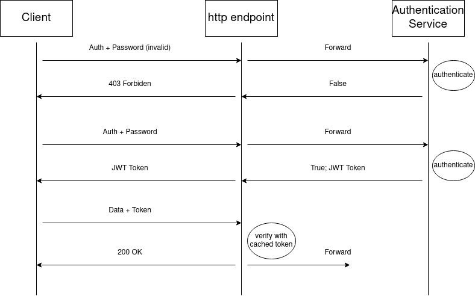

# Authentication service

## Overview

Use a token based system for the authentication of devices. The authentication service can support multiples authentication mechanisms and hands out a token if authentication is sucessfull. 
In order to avoid the authentication process for each message, the token have a limited *validity period* and are cached by the adapters. 
Subsequent requests from the devices contains the token. 

## Technologies

JWT seems to be a good fit for that process. Since it's a simple JSON object it can be easily extended to integrate with an authorization service later down the road.
